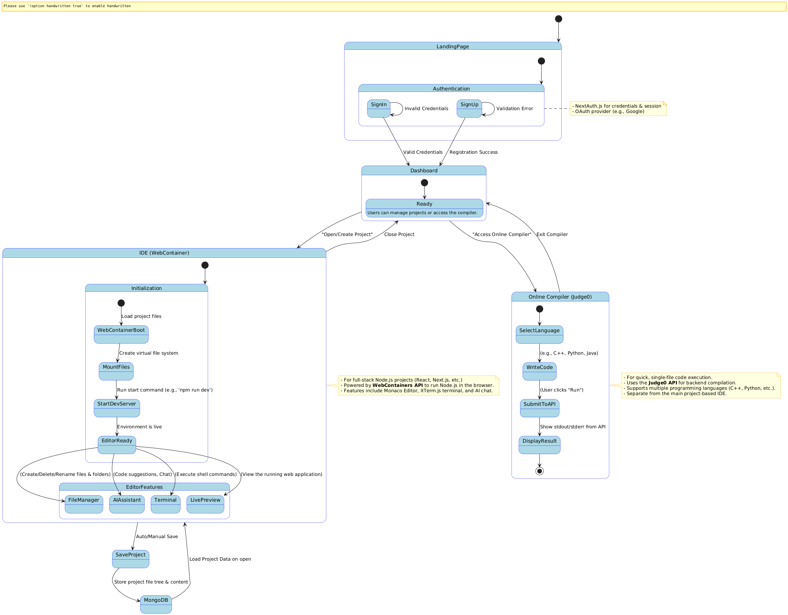
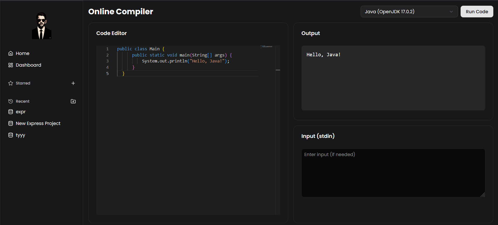

# 🚀 BroCode Editor

A modern, feature-rich online code editor with WebContainer integration, AI-powered assistance, multi-framework support, and an integrated online compiler.

## System Architecture
 

## ✨ Features

- **WebContainer Integration**: Run Node.js applications directly in the browser
- **Multi-Framework Support**: Built-in templates for React, Next.js, Vue, and more
- **AI-Powered Assistance**: Get code suggestions and chat with AI
- **Online Code Compiler**: Write, run, and debug code in multiple languages directly from your dashboard
  - Powered by Judge0 API for reliable code execution
  - Real-time code execution with detailed output
  - Support for standard input (stdin)
  - Detailed error reporting for compilation and runtime errors
- **Supported Languages**:
  - C++ (GCC 11.2.0)
  - C (GCC 11.2.0)
  - Python (3.11.2)
  - JavaScript (Node.js 20.1.0)
  - Java (OpenJDK 17.0.2)
  - Go (1.20.1)
  - Rust (1.70.0)

- **Monaco Editor**: The same editor that powers VS Code
- **Terminal Access**: Full terminal access within the browser
- **Themes**: Dark/Light mode support
- **File Explorer**: Intuitive file management
- **Responsive Design**: Works on desktop and tablet devices

## 📸 Screenshots

<div align="center">
  <h3>🎨 Editor Interface</h3>
  
  
 
  
  <h3>💬 AI Chat Assistant</h3>
  
  
  <h3>📁 Dashboard</h3>
  
  
  <h3>💻 Online Compiler</h3>
  
  
  <h3>▶️ Demo Video</h3>
  <p>Watch the demo video on Google Drive: <a href="https://drive.google.com/file/d/1O47CElx0LnMNmgOK0WhQFo0r2wppQ0kw/view" target="_blank">BroCode Editor Demo</a></p>

 
</div>

## 🛠 Tech Stack

- **Frontend**: Next.js 15, React 19, TypeScript
- **Code Execution**: Judge0 API
- **Styling**: Tailwind CSS, Radix UI
- **Code Editing**: Monaco Editor, XTerm.js
- **Containerization**: WebContainers API
- **AI**: Google Generative AI
- **Authentication**: NextAuth.js
- **Database**: Prisma with MongoDB
- **State Management**: Zustand
- **UI Components**: Shadcn/UI

## 🚀 Getting Started

### Prerequisites

- Node.js 18+ and npm 9+
- MongoDB Atlas account (for database)
- Google Cloud account (for AI features)

### Installation

1. Clone the repository:
   ```bash
   git clone https://github.com/Abhay2004Kumar/Stable-broCode.git
   cd BroCOde
   ```

2. Install dependencies:
   ```bash
   npm install
   ```

3. Set up environment variables:
   Create a `.env` file in the root directory and add the following:
   ```env
   DATABASE_URL="mongodb+srv://<username>:<password>@<cluster>.mongodb.net/brocode?retryWrites=true&w=majority"
   NEXTAUTH_SECRET=your_nextauth_secret
   NEXTAUTH_URL=your_local_or_deployed_url
   GOOGLE_CLIENT_ID=your_google_client_id
   GOOGLE_CLIENT_SECRET=your_google_client_secret
   GEMINI_API_KEY=your_gemini_api_key
   ```

4. Initialize the database:
   ```bash
   npx prisma generate
   npx prisma db push
   ```

5. Start the development server:
   ```bash
   npm run dev
   ```

6. Open [http://localhost:3000](http://localhost:3000) in your browser.

## 📦 Available Scripts

- `npm run dev` - Start the development server
- `npm run build` - Build the application for production
- `npm start` - Start the production server
- `npm run lint` - Run ESLint

## 🏗 Project Structure

```
brocode/
├── app/                    # Next.js app directory
│   ├── api/                # API routes
│   ├── auth/               # Authentication pages
│   ├── dashboard/          # Dashboard pages
│   └── playground/         # Code playground
├── components/             # Reusable components
├── features/               # Feature modules
│   ├── ai-chat/            # AI chat functionality
│   ├── auth/               # Authentication logic
│   ├── dashboard/          # Dashboard features
│   └── webcontainers/      # WebContainer integration
├── lib/                    # Utility functions
├── prisma/                 # Database schema
└── public/                 # Static files
```

## 🌟 Supported Frameworks

- React
- Next.js
- Vue
- Svelte
- Node.js
- And many more through custom templates

## 🤝 Contributing

Contributions are welcome! Please follow these steps:

1. Fork the repository
2. Create a new branch: `git checkout -b feature/your-feature`
3. Make your changes and commit: `git commit -m 'Add some feature'`
4. Push to the branch: `git push origin feature/your-feature`
5. Open a pull request

## 📄 License

This project is licensed under the MIT License - see the [LICENSE](LICENSE) file for details.

## 🙏 Acknowledgments

- Next.js and Vercel for the amazing framework
- The WebContainer team for making browser-based Node.js possible
- The open-source community for all the amazing libraries used in this project
